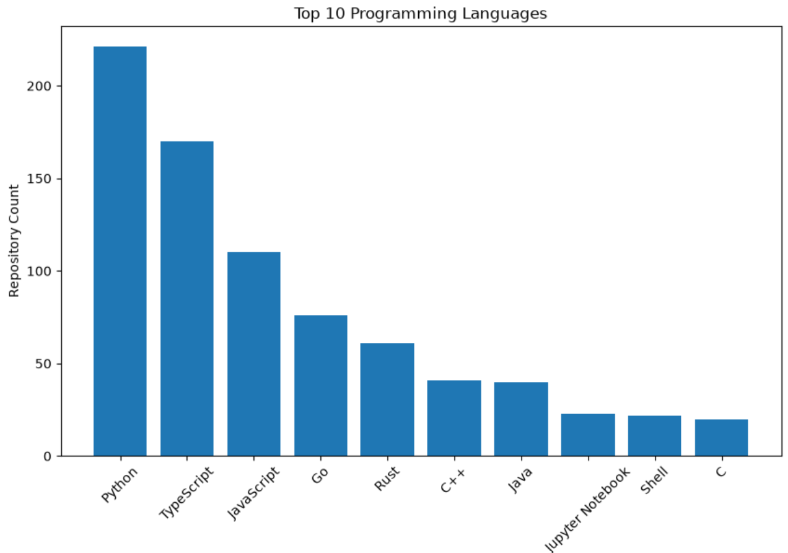
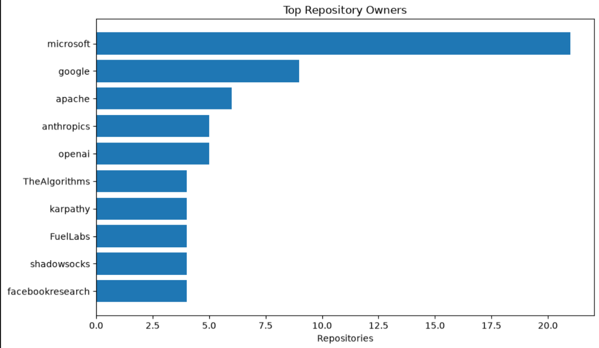
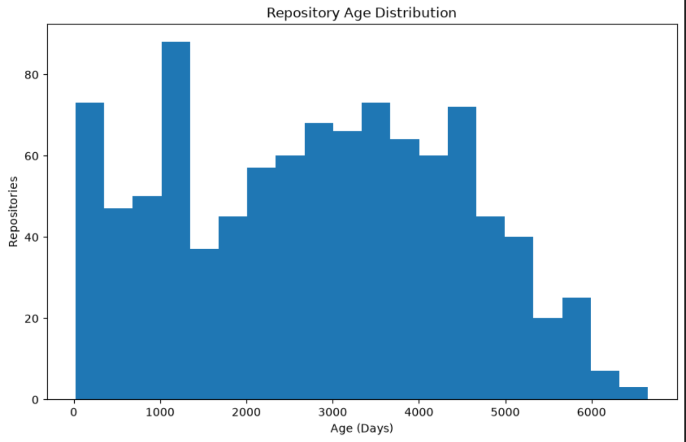
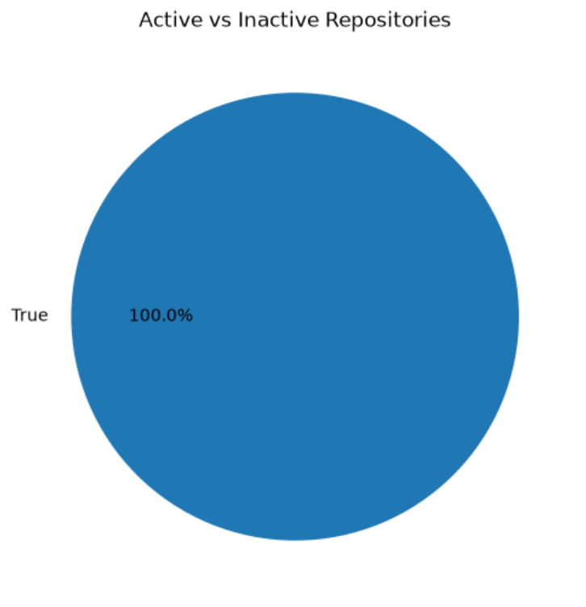
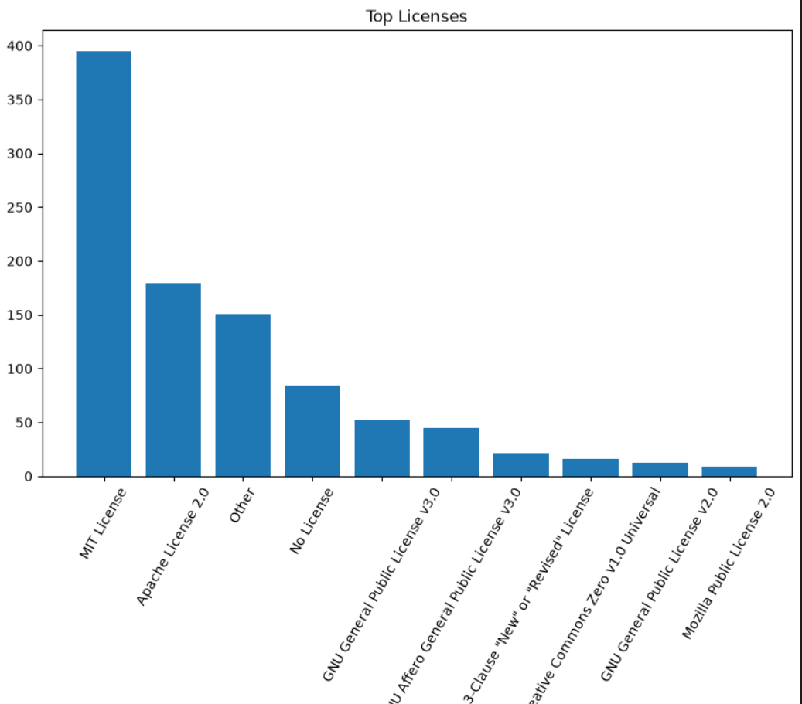
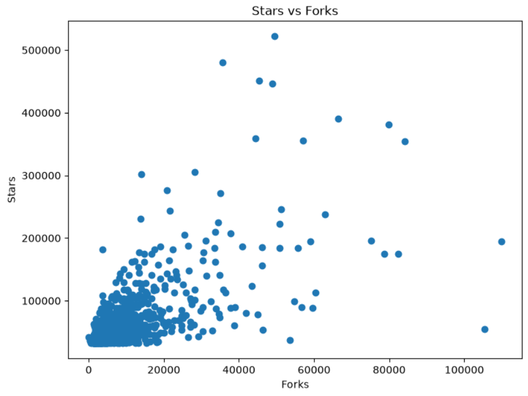

# GitHub Repository Analytics & Dataset Pipeline

An end-to-end Data Engineering project that collects repository metadata using the GitHub REST API, transforms raw JSON into a structured dataset, performs feature engineering, and conducts Exploratory Data Analysis (EDA). The processed dataset is exported in both CSV and Parquet formats, making it suitable for analytics, machine learning, and further research.

---

## Project Overview

This project demonstrates a complete ETL (Extract, Transform, Load) pipeline using the GitHub REST API. Repository metadata is collected through authenticated API requests, cleaned and transformed into a structured dataset, enriched with engineered features, and analyzed through visualizations.

The project follows industry-standard data engineering practices, including modular code organization, secure credential management, reproducible data processing, and structured documentation.

---

## Project Workflow

```
GitHub REST API
        │
        ▼
Repository Data Collection
        │
        ▼
Raw JSON Storage
        │
        ▼
Data Cleaning & Transformation
        │
        ▼
Feature Engineering
        │
        ▼
Exploratory Data Analysis
        │
        ▼
CSV & Parquet Export
```

---

## Project Structure

```text
github-repository-analytics/
│
├── data/
│   ├── raw/
│   │   └── repositories_raw.json
│   │
│   └── processed/
│       ├── github_repositories.csv
│       ├── github_repositories.parquet
│       └── github_repositories_featured.csv
│
├── notebook/
│   └── github_repository_eda.ipynb
│
├── src/
│   ├── config.py
│   ├── fetch_repositories.py
│   ├── clean_data.py
│   └── feature_engineering.py
│
├── README.md
├── LICENSE
├── requirements.txt
└── .gitignore
```

---

## Technology Stack

| Category | Technologies |
|-----------|--------------|
| Programming Language | Python |
| API | GitHub REST API |
| Data Processing | Pandas |
| HTTP Requests | Requests |
| Progress Tracking | tqdm |
| Environment Variables | python-dotenv |
| Visualization | Matplotlib |
| Notebook | Jupyter Notebook |
| Data Storage | CSV, Parquet |

---

## ETL Pipeline

### Extract

- Connected to the GitHub REST API using Personal Access Token authentication.
- Retrieved repository metadata with API pagination.
- Stored raw API responses in JSON format.

### Transform

- Parsed nested JSON responses.
- Extracted meaningful repository attributes.
- Cleaned missing values.
- Structured the dataset into a tabular format.

### Feature Engineering

Additional analytical features created include:

- Repository Age (Days)
- Days Since Last Update
- Star-to-Fork Ratio
- Repository Activity Status
- Description Length
- License Availability

### Load

Exported the processed dataset in:

- CSV Format
- Parquet Format

---

## Dataset Features

| Feature | Description |
|----------|-------------|
| repository_name | Repository name |
| full_name | Complete repository name |
| owner | Repository owner |
| description | Repository description |
| language | Primary programming language |
| stars | Stargazer count |
| forks | Fork count |
| watchers | Watcher count |
| open_issues | Number of open issues |
| license | Repository license |
| created_at | Repository creation date |
| updated_at | Last updated date |
| repository_age_days | Repository age in days |
| days_since_last_update | Days since last update |
| star_fork_ratio | Ratio of stars to forks |
| is_active | Repository activity status |
| description_length | Length of repository description |
| has_license | Indicates license availability |

---

# Exploratory Data Analysis

## Top 10 Programming Languages

<p align="center">

</p>

---

## Top 10 Starred Repositories

<p align="center">

</p>

---

## Repository Age Distribution

<p align="center">

</p>

---

## Active vs Inactive Repositories

<p align="center">

</p>

---

## License Distribution

<p align="center">

</p>

---

## Stars vs Forks Relationship

<p align="center">

</p>

---

## Key Insights

- Successfully collected repository metadata from the GitHub REST API using authenticated requests.
- Built a modular ETL pipeline for data collection, transformation, and export.
- Generated structured datasets in both CSV and Parquet formats.
- Created engineered features to improve analytical capabilities.
- Identified the most common programming languages among highly starred repositories.
- Analyzed repository popularity through star and fork distributions.
- Examined repository maintenance trends using activity metrics.

---

## Installation

Clone the repository

```bash
git clone https://github.com/MOHITEhere/github-repository-analytics.git
```

Navigate to the project directory

```bash
cd github-repository-analytics
```

Create a virtual environment

```bash
python -m venv venv
```

Activate the environment

```bash
venv\Scripts\activate
```

Install the required dependencies

```bash
pip install -r requirements.txt
```

Create a `.env` file

```env
GITHUB_TOKEN=your_github_personal_access_token
```

---

## Running the Pipeline

Fetch repository data

```bash
python src/fetch_repositories.py
```

Clean the dataset

```bash
python src/clean_data.py
```

Perform feature engineering

```bash
python src/feature_engineering.py
```

Launch the notebook

```bash
jupyter notebook
```

---

## Future Enhancements

- Collect repositories across multiple technology domains.
- Automate scheduled dataset updates.
- Add logging and monitoring.
- Integrate Docker for containerization.
- Implement GitHub Actions for CI/CD.
- Publish automated Kaggle dataset updates.
- Develop machine learning models using the generated dataset.

---

## Learning Outcomes

This project provided hands-on experience in:

- REST API Integration
- Data Engineering
- ETL Pipeline Development
- Data Cleaning
- Feature Engineering
- Exploratory Data Analysis
- Dataset Preparation
- Git and GitHub
- Technical Documentation

---

## License

This project is released under the MIT License. See the `LICENSE` file for more information.
